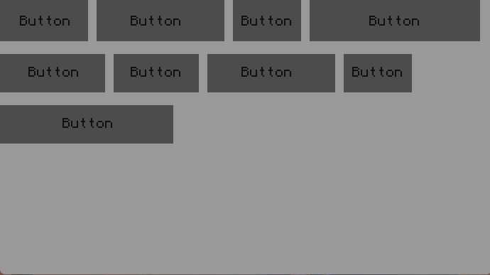

A Flexbox is a layout container designed to facilitate the creation of flexible and responsive UI designs. It allows you to efficiently arrange and align its child elements within it.

The Flexbox Container is still a WIP and i will add more methods from the CSS Flexbox Implementation.

In addition to the methods inherited from ScrollableFrame, Frame, Container, VisualObject and Object, Flexbox has the following methods:

|   |   |
|---|---|
|[setSpacing](objects/Flexbox/setSpacing.md)|Defines the gap between child objects within the Flexbox
|[getSpacing](objects/Flexbox/getSpacing.md)|Returns the current gap size between child objects
|[setDirection](objects/Flexbox/setDirection.md)|Sets the direction for the arrangement of child objects (row/column)
|[getDirection](objects/Flexbox/getDirection.md)|Returns the currently set arrangement direction of child objects
|[setJustifyContent](objects/Flexbox/setJustifyContent.md)|Sets the alignment of child objects along the main axis (flex-start, center, flex-end, space-between, space-around, space-evenly)
|[getJustifyContent](objects/Flexbox/getJustifyContent.md)|Returns the current alignment setting for child objects along the main axis
|[setWrap](objects/Flexbox/setWrap.md)|Determines if child objects should wrap onto the next line when they run out of space
|[getWrap](objects/Flexbox/getWrap.md)|Returns the current wrapping behavior for child objects
|[updateLayout](objects/Flexbox/updateLayout.md)|Manually triggers a layout update for the Flexbox
|[addBreak](objects/Flexbox/addBreak.md)|Introduces a line break within the Flexbox, forcing subsequent child objects to the next line

Child objects added via the Flexbox have the following additional methods:

|   |   |
|---|---|
|[getFlexGrow](objects/Flexbox/getFlexGrow.md)|Returns the flex grow factor of the child object
|[setFlexGrow](objects/Flexbox/setFlexGrow.md)|Sets the flex grow factor of the child object
|[getFlexShrink](objects/Flexbox/getFlexShrink.md)|Returns the flex shrink factor of the child object
|[setFlexShrink](objects/Flexbox/setFlexShrink.md)|Sets the flex shrink factor of the child object
|[getFlexBasis](objects/Flexbox/getFlexBasis.md)|Returns the flex basis of the child object
|[setFlexBasis](objects/Flexbox/setFlexBasis.md)|Sets the flex basis of the child object

## Examples

### Nested Flexbox

Flexboxes can be nested within each other to create more complex layouts. This example demonstrates how to nest flexboxes.

<details>
<summary>Click here to show code</summary>

```lua
local flex = main:addFlexbox():setWrap("wrap"):setBackground(colors.lightGray):setPosition(1, 1):setSize("parent.w", "parent.h")

flex:addButton():setSize(10, 3)
flex:addButton():setSize(15, 3)
flex:addButton():setSize(8, 3)
flex:addButton():setSize(20, 3)
flex:addButton()
flex:addButton():setSize(10, 3)
flex:addButton():setSize(15, 3)
flex:addButton():setSize(8, 3)
flex:addButton():setSize(20, 3)
```

</details>
<br>



### FlexGrow Property

<details>
<summary>Click here to show code</summary>

```lua
local basalt = require("basalt")

local main = basalt.createFrame()

local function makeResizeable(frame, minW, minH, maxW, maxH)
    minW = minW or 4
    minH = minH or 4
    maxW = maxW or 99
    maxH = maxH or 99
    local btn = frame:addButton()
        :ignoreOffset()
        :setPosition("parent.w", "parent.h")
        :setSize(1, 1)
        :setText("/")
        :setForeground(colors.black)
        :setBackground(colors.gray)
        :onDrag(function(self, _, _, xOffset, yOffset)
            local w, h = frame:getSize()
            local wOff, hOff = w, h
            if(w+xOffset-1>=minW)and(w+xOffset-1<=maxW)then
                wOff = w+xOffset-1
            end
            if(h+yOffset-1>=minH)and(h+yOffset-1<=maxH)then
                hOff = h+yOffset-1
            end
            frame:setSize(wOff, hOff)
        end)
end

local flexFrame = main:addMovableFrame():setSize(23, 12):setPosition(2, 2):setBackground(colors.gray):setBorder(colors.black)
local flex = flexFrame:addFlexbox():setWrap("wrap"):setPosition(2, 2):setSize("parent.w - 2", "parent.h - 2"):setBackground(colors.gray):setForeground(colors.black):setTheme({ButtonBG=colors.black, ButtonText=colors.lightGray})
flex:addButton():setFlexBasis(1):setFlexGrow(1)
flex:addButton():setFlexBasis(1):setFlexGrow(1)
flex:addButton():setFlexBasis(1):setFlexGrow(1)
flex:addButton():setFlexBasis(1):setFlexGrow(1)
flex:addButton():setFlexBasis(1):setFlexGrow(1)
flex:addButton():setFlexBasis(1):setFlexGrow(1)
flex:addButton():setFlexBasis(1):setFlexGrow(1)
flex:addButton():setFlexBasis(1):setFlexGrow(1)

makeResizeable(flexFrame, 11, 6)

basalt.autoUpdate()
```

</details>
<br>
<video width="600" controls autoplay loop muted>
  <source src="./_media/flexgrow-property.mp4" type="video/mp4">
</video>

#### Another example

This is another example, which shows how frames work with flexbox

<details>
<summary>Click here to show code</summary>

```lua
local basalt = require("BasaltDev2")

local main = basalt.createFrame()

local function makeResizeable(frame, minW, minH, maxW, maxH)
    minW = minW or 4
    minH = minH or 4
    maxW = maxW or 99
    maxH = maxH or 99
    local btn = frame:addButton()
        :ignoreOffset()
        :setPosition("parent.w", "parent.h")
        :setSize(1, 1)
        :setText("/")
        :setForeground(colors.black)
        :setBackground(colors.gray)
        :onDrag(function(self, _, _, xOffset, yOffset)
            local w, h = frame:getSize()
            local wOff, hOff = w, h
            if(w+xOffset-1>=minW)and(w+xOffset-1<=maxW)then
                wOff = w+xOffset-1
            end
            if(h+yOffset-1>=minH)and(h+yOffset-1<=maxH)then
                hOff = h+yOffset-1
            end
            frame:setSize(wOff, hOff)
        end)
end

local flexFrame = main:addMovableFrame():setSize(23, 12):setPosition(2, 2):setBackground(colors.gray):setBorder(colors.black)
local flex = flexFrame:addFlexbox():setWrap("wrap"):setPosition(2, 2):setSize("parent.w - 2", "parent.h - 2"):setBackground(colors.gray):setForeground(colors.black):setTheme({ButtonBG=colors.black, ButtonText=colors.lightGray})
local f1 = flex:addFrame():setBackground(colors.black):setSize(25, 10):setFlexBasis(1):setFlexGrow(1)
local f2 = flex:addFrame():setBackground(colors.black):setSize(25, 10):setFlexBasis(1):setFlexGrow(1)

f1:addLabel():setForeground(colors.lightGray):setText("Frame 1"):setPosition("parent.w/2-self.w/2", 2)
f1:addButton():setText("Button"):setPosition(2, 4):setBackground(colors.gray):setForeground(colors.black):setSize("math.floor(parent.w - 2)", 3)
f2:addLabel():setForeground(colors.lightGray):setSize("parent.w", "parent.h"):setText("lorem ipsum dolor sit amet, consectetur adipiscing elit. sed non risus. suspendisse lectus tortor, dignissim sit amet, adipiscing nec, ultricies sed, dolor. cras elementum ultrices diam. maecenas ligula massa, varius a, semper congue, euismod non, mi. proin porttitor, orci nec nonummy molestie, enim est eleifend mi, non fermentum diam nisl sit amet erat. Duis semper. Duis arcu massa, scelerisque vitae, consequat in, pretium a, enim. Pellentesque congue. Ut in risus volutpat libero pharetra tempor. Cras vestibulum bibendum augue. Praesent egestas leo in pede. Praesent blandit odio eu enim. Pellentesque sed dui ut augue blandit sodales. Vestibulum ante ipsum primis in faucibus orci luctus et ultrices posuere cubilia Curae; Aliquam nibh. Mauris ac mauris sed pede pellentesque fermentum. Maecenas adipiscing ante non diam sodales hendrerit.")
makeResizeable(flexFrame, 11, 6)

basalt.autoUpdate()
```

</details>
<br>
<video width="600" controls autoplay loop muted>
  <source src="./_media/frame-flexgrow-property.mp4" type="video/mp4">
</video>
