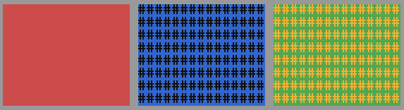

A Pane object is used for visual background modification without listening to any events by default.

Since Pane objects don't have any unique functionality, there is no method list for them. However, they inherit methods from the Object and VisualObject classes.

```lua
local mainFrame = basalt.createFrame()
local aPane = mainFrame:addPane()
aPane:setSize(30, 10)
aPane:setBackground(colors.yellow)
```

```xml
<pane width="30" height="10" bg="yellow" />
```

### Other examples



```lua
main:addPane():setSize(15, 8):setPosition(2, 2):setBackground(colors.red)
main:addPane():setSize(15, 8):setPosition(18, 2):setBackground(colors.blue, "#")
main:addPane():setSize(15, 8):setPosition(17 * 2, 2):setBackground(colors.green, "#", colors.orange)
```

You could also create a 1-line height pane with dynamic width:


```lua
main:addPane():setSize("parent.w - 2", 1):setPosition(2, 2):setBackground(false, "\140", colors.blue)
main:addPane():setSize("parent.w - 2", 1):setPosition(2, 4):setBackground(colors.black, "\45", colors.red)
main:addPane():setSize("parent.w - 2", 1):setPosition(2, 6):setBackground(false, "\183", colors.purple)
```

You can also do that in the y direction instead of the x direction.
